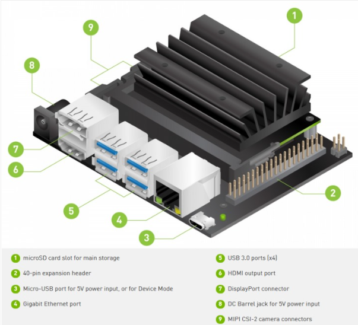
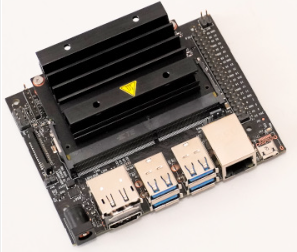
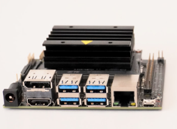
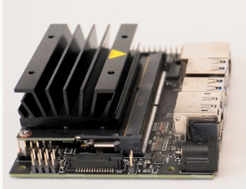
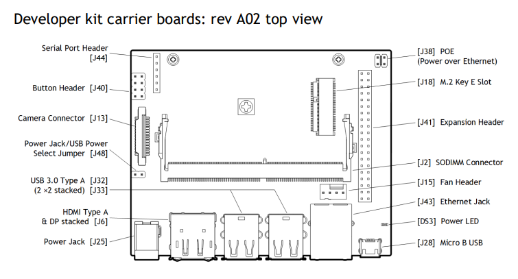
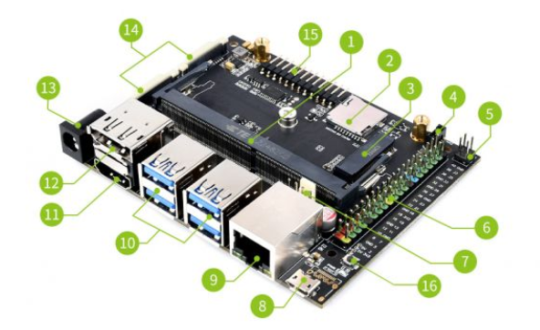

## Preface
The NVIDIA® Jetson Nano™ Developer Kit delivers the compute performance to run modern AI workloads at unprecedented size, power, and cost. Developers, learners, and makers can now run AI frameworks and models for applications like image classification, object detection, segmentation, and speech processing.

The developer kit can be powered by micro-USB and comes with extensive I/Os, ranging from GPIO to CSI. This makes it simple for developers to connect a diverse set of new sensors to enable a variety of AI applications. It's incredibly power-efficient, consuming as little as 5 watts.

Jetson Nano is also supported by NVIDIA JetPack, which includes a board support package (BSP), Linux OS, NVIDIA CUDA®, cuDNN, and TensorRT™ software libraries for deep learning, computer vision, GPU computing, multimedia processing, and much more. The software is even available using an easy-to-flash SD card image, making it fast and easy to get started. The same JetPack SDK is used across the entire NVIDIA Jetson™ family of products and is fully compatible with NVIDIA's world-leading AI platform for training and deploying AI software. This proven software stack reduces complexity and overall effort for developers.

 

## Technical Specifications

> Name：Jetson Nano Developer Kit 
> 型號：<u>A02</u>（the next version is B01） 
> CPU：Quad-core ARM® Cortex®-A57 MPCore processor 1.43 GHz 
> GPU：NVIDIA Maxwell™ architecture with 128 NVIDIA CUDA® cores and 0.5 TFLOPS (FP16) 
> Storage：MicroSD slot（Mirco SD is not included）</u> 
> USB：4 * USB 3.0 Type-A;&nbsp;&nbsp;&nbsp;1 * Micro-USB port for 5V power input or for device mode 
> Networking：1*RJ45 Gigabit Ethernet Connector (10/100/1000) 
> Display：2 multi-mode DP 1.2/eDP 1.4/HDMI 2.0,  1 x2 DSI (1.5Gbps/lane) 
> Video Encoder：4Kp30 | 4x 1080p30 | 9x 720p30 (H.264/H.265) 
> Video Decoder：4Kp60 | 2x 4Kp30 | 8x 1080p30 | 18x 720p30 (H.264/H.265) 
> Camera：1x MIPI CSI-2 DPHY lanes 
> Other I/O：3 x UART, 2 x SPI, 2 x $I^{2}S$, 4 x $I^{2}C$, multi GPIO headers 
> Power：DC Jack 5V⎓4A；Micro-USB 5V⎓2A 
> Mechanical：100 mm x 80 mm x 29 mm 
> M.2 KEY E：1 * M.2 Key E 
> Multifunctional port：1 * 40-Pin header 
> Note：No RTC, no M.2 KEY M 
> Nvidia Official Introduction：[Click here](https://developer.nvidia.com/embedded/jetson-nano-developer-kit) 
> <u>Jetson Nano Developer Kit User Guide：[Click here](https://developer.download.nvidia.com/assets/embedded/secure/jetson/Nano/docs/NV_Jetson_Nano_Developer_Kit_User_Guide.pdf?YPzabQ09aElmoX5FDbh3Ph-Tghj5ymsejEV1dzS7kIjix3Oq0HlDkaH0Iv3YGfDeRu1K9LbNJTwfordNKHRVsnZVkHMLteDHd03M6O04jDnCbeTwNAhck-9uuMabrWczWPg_ChoHbxSBrX2osjG3Ls8elcmerColzSM6_HDHYjS8KlcunrVnZVlRHOeE1QX29WM=&t=eyJscyI6ImdzZW8iLCJsc2QiOiJodHRwczovL3d3dy5nb29nbGUuY29tLyJ9)</u> 
> Jetson Nano （module）Data Sheet & Manual：[Click here](https://developer.download.nvidia.com/assets/embedded/secure/jetson/Nano/docs/JetsonNano_DataSheet_DS09366001v1.1.pdf?GkzU5LqxOS0iRadkMrpA715wy6VZdMlTnZk2bGq4M4NIaNgVFA1ugXZBPyBlp1EVTz4gxkIUlXdhKKe_kz4M8onOq3dcM7QXNQuxhKOy11q6PEYJ7gukuox5zt5lL9NtrzXsKTY2hixSXHM0P7QC1x12ks47HIsH1i7f_pAw3FHXf4i5gH4p3Q0YTFUWJQ==&t=eyJscyI6IndlYnNpdGUiLCJsc2QiOiJkZXZlbG9wZXIubnZpZGlhLmNvbS9lbWJlZGVkL3N1cHBvcnQifQ== "") 
> Jetson Nano （module）Compares with Other Jetson Series：[Click here then find and see the technical specifications](https://developer.nvidia.com/embedded/jetson-modules "")
    

 

## Apearance

 

## Brief board description

   

## Real Onboard Resources

1. Core module socket
    - Insert Jetson Nano core board
2. SD card slot
    - SD card can be connected for SD card expansion.
3. M.2 Key E connector
    - AC8265 wireless network card can be connected
4. 1.25mm fan header
5. PoE pin
    - PoE module is not included.
6. 40-PIN GPIO header
    - Compatible with Raspberry Pi pins, convenient for Raspberry Pi peripherals (requires program support).
7. 2.54mm fan header
8. Micro USB port
    - for 5V power input or for USB data transmission
9. Gigabit Ethernet port
    - 10/100/1000Base-T auto-negotiation, supports PoE if external PoE module is connected.
10. 4x USB 3.0 port
11. HDMI output port
12. DisplayPort connector
13. DC jack
    - for 5V power input
14. 2x MIPI CSI camera connector
15. Multi-function 12PIN header
    - You can configure the Nano by short-circuiting the corresponding pins using jumpers/wires.
    - Connect PWR_BTN and GND pin to initiate power-on if Auto-Power-On disabled.
    - Connect DIS and AUTO ON to disable Auto-Power-On and require power automation press.
    - Connect FC REC and GND during power-on to put system in USB Force Recovery mode.
    - Temporarily connect GND and SYS_RST to reset system.
    - UART TXD and UART RXD are the UART debugging pins.
    - LED+ and LED- indicate System Sleep/Wake [Off when system in sleep mode]
16. PWR button
    - This button is adapted through the 12PIN, and its function is the same as the PWR BTN pin.
    - Temporarily pressing this button can power the Nano when powered off.
    - Temporarily pressing this button will initiate a soft shutdown in a normal power-on state, and it will automatically power off if no power-off option is selected for a while.
    - A long press of 15 seconds or more will force Nano to power off. 

    

     

